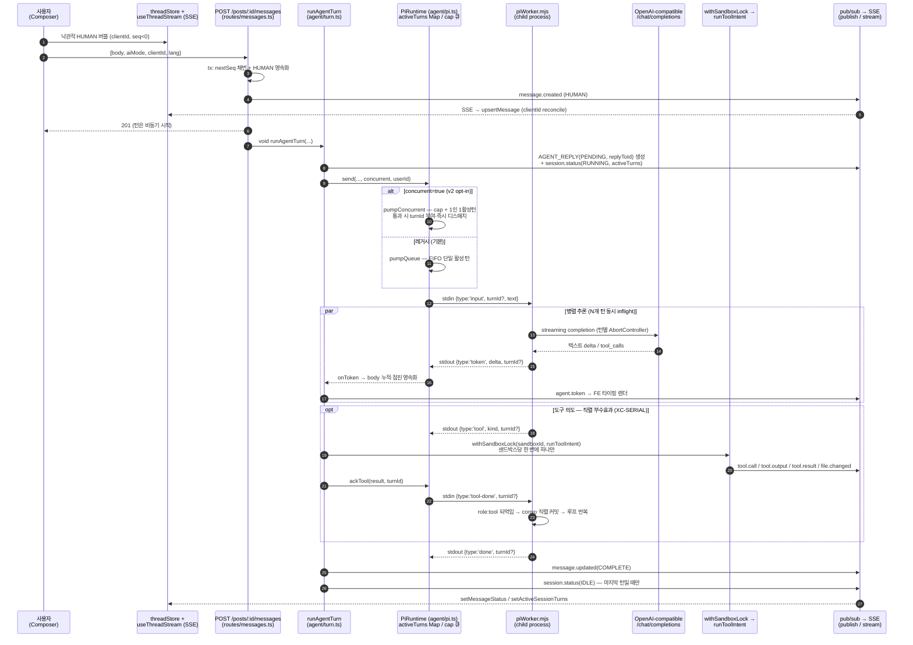

# AIDIT-CODE

```
$ post --new "게시글 하나 = 살아있는 코드 에이전트 세션"
[ READY ] sandbox provisioned — attach to stream
```

**Aidit-Code**는 게시글마다 백엔드 샌드박스에서 도는 코드 에이전트(pi agent)에 여러 사람이 함께 붙어, AI on/off로 채팅하며 협업 코딩하는 플랫폼입니다. 부모 프로젝트 **Aidit**(공유 AI 대화 컨텍스트 커뮤니티)의 형제 프로젝트로, 그린 인광 CRT 레트로 터미널 디자인을 100% 계승하되 동작 모델을 교체했습니다 — 글 스레드는 더 이상 텍스트 대화가 아니라 **샌드박스에서 실제로 도는 코드 에이전트 세션**입니다.

---

## 1. 프로젝트 소개

### 목적

- 에이전트는 게시글 전용 샌드박스 안에서 **파일을 만들고, 쉘을 돌리고, 패키지를 설치**합니다.
- 모든 참여자는 같은 세션에 attach하여 에이전트의 토큰·도구 호출·파일 변경 이벤트를 **SSE로 실시간 fan-out** 받아 함께 봅니다.
- **LLM 비용·키는 서버 운영자 부담**(BYOK 전면 폐기). 키는 서버 `.env`에만 존재하며 클라이언트·응답·로그에 절대 노출되지 않습니다.

### 해결하는 문제

1. **(v0.1)** 여러 사람이 하나의 살아있는 코드 에이전트 세션을 공유하며 함께 지시/관전/스티어링할 공간이 없다 → **"게시글 = 살아있는 코드 에이전트 세션"** 모델로 해결.
2. **(v2, 핵심 차별점)** v0.1의 **머리-막힘(head-of-line blocking)** — 동시 질문이 단일 활성 턴 + FIFO 큐로 직렬화되어 내 질문이 남의 긴 작업 뒤에 대기하는 문제 → **"병렬 추론 + 직렬 부수효과"** 모델로 해결.

### 핵심 가치 — 병렬 추론 + 직렬 부수효과 (v2)

- N명의 질문이 각자 독립 턴(`turnId`)으로 **동시에 병렬 추론·즉시 스트리밍**됩니다.
- 파일 쓰기/도구 실행 같은 **부수효과만 샌드박스 단위 단일 직렬 실행기**(sandbox lock)로 순차 적용되어 충돌·머지가 필요 없습니다.
- 단일 세션·단일 공유 컨텍스트(convo)·단일 샌드박스라는 협업 모델은 그대로 유지됩니다.
- 각 에이전트 답글은 `replyToId`로 자기 질문에 **1:1 귀속**됩니다(배칭 없음).
- v2는 **opt-in(기본 OFF)**: 게시글 생성 시 체크박스로 켜며, 글 단위 1회 확정·변경 불가.
- 이 논지는 특허 문서(PATENT.html)와 논문(PAPER.html)의 중심 주제이기도 합니다.

#### 측정된 효과 (n=180, 2026-07-28)

A가 길이 L의 작업을 시작하고 **1초 뒤** B가 한 줄 질문을 던졌을 때, B의 첫 토큰까지 걸린 시간:

| 동시성 계약 | L=2s | L=6s | L=15s | TTFT ~ L 기울기 |
|---|---|---|---|---|
| 직렬 (v0.1 FIFO) | 1.93s | 5.93s | 14.93s | **1.000** — 완전 종속 |
| 거절 + 재시도 | 2.26s | 6.30s | 15.39s | **1.010** — 더 나쁨 |
| **병렬 (v2)** | **0.24s** | **0.24s** | **0.24s** | **0.000** — 완전 독립 |


**20초 대비 클립**: [`docs/assets/hol-clip.mp4`](./docs/assets/hol-clip.mp4) — 왼쪽(직렬)에서 바다의
대기 카운터가 실시간으로 14.93초까지 올라가는 동안, 오른쪽(병렬)은 0.23초에 응답을 시작한다.
수치는 위 실측 상수에서 결정적으로 생성되므로 표·그림과 절대 어긋나지 않는다
(재생성: `cd frontend && npm run clip:hol`).

핵심은 배수(L=15s에서 63.5배)가 아니라 **기울기 0**입니다 — 남의 작업이 얼마나 길든 내 대기는 늘지 않습니다.
재현: `cd backend && npm run bench:e2` (모의 LLM 사용 — 실 LLM 키·네트워크 불필요).

**부수효과 안전성도 실측했습니다(E1 ablation)** — 직렬 실행기를 우회하면 같은 파일 동시 쓰기에서
위반률 **74%**(두 writer 마커가 한 파일에 공존, 3회 모두 최종 파일 오염), 락 적용 시 **0%**입니다.
즉 이 락은 장식이 아니라 **결과물이 망가지는 것을 막고 있습니다**. 재현: `cd backend && npm run bench:e1`.

> **적용 범위(실측된 한계)**: 위 수치는 동시 질문이 **추론 중심**일 때입니다(설명·리뷰·질의응답 등
> 샌드박스를 건드리지 않는 작업). 동시 질문이 **모두 파일을 수정**하면 직렬 실행기가 병목이 되어
> 이점이 **1.07×(결정적)~1.35×(실 LLM)** 로 줄어듭니다 — 부수효과를 직렬화하기로 *선택*한 계약의
> 필연적 귀결이며, 그 대가로 파일 깨짐 0·머지 불필요·1:1 귀속을 얻습니다.
> 측정과 논의는 [docs/EXPERIMENTS.md §E2·E2-B](./docs/EXPERIMENTS.md) 참조.

## 2. 주요 기능

- **인증**: username+password 회원 또는 **게스트 진입**(닉네임만, 서버가 `#hex4` 부여 — 예: `철수#a3f9`). JWT 슬라이딩 갱신(7일). API 키 입력 화면 없음.
- **홈 = 게시글 인기 피드**: hot/new 정렬, 커서 기반 무한 스크롤, 카드마다 샌드박스 상태 요약.
- **글 작성 → 샌드박스 1:1 자동 생성**: CREATING→READY 비동기 프로비저닝, 게시 즉시 Thread 진입. 게시 후 AI 1차 답변 받기 옵션(reasoning effort 낮음/중간/높음), (v2) 동시 병렬 협업 opt-in 체크박스.
- **협업 채팅 스레드**: 상단 원본 글 고정 + 채팅방형 버블(HUMAN/AGENT_REPLY/TOOL_CALL/TOOL_RESULT/SYSTEM 5종). 다중 사용자 attach 시 모든 이벤트가 SSE로 전원에게 실시간 중계.
- **AI on/off 토글**: on이면 사람 메시지가 pi agent 세션에 주입되어 에이전트 턴 시작(토큰 단위 스트리밍), off면 사람끼리 채팅.
- **도구 호출·터미널 출력 버블**: 쉘 명령이 `$ <cmd>` 스타일 TOOL_CALL 버블로, stdout/stderr가 TOOL_RESULT 버블에 스트리밍 누적(성공/실패 색·exitCode).
- **워크스페이스/파일 트리 패널**: 샌드박스 파일 트리·내용 조회, `file.changed` 이벤트로 라이브 갱신.
- **인터럽트/스티어링**: 진행 중 턴 중단(+선택 steer 텍스트). v2에서는 특정 `turnId` 대상이라 남의 턴에 영향 없음.
- **샌드박스 라이프사이클**: create → attach → run → interrupt → suspend(프로세스 내림·파일 보존) → resume → cleanup.
- **추천(업보트)·북마크·프로필**(`/me`, [posts|bookmarks] 탭), **이미지 첨부 + 에이전트 비전**, 게시글 삭제 시 샌드박스 정리.
- **i18n(KO/EN)**: 헤더 `[ KO | EN ]` 토글, 에이전트 응답도 가능 범위에서 UI 언어 추종.
- **(v2) 동시 병렬 협업**: 여러 AGENT_REPLY 동시 스트리밍, 1:1 귀속 시각 연결(↳@이름), "N개 작업 진행 중" 배지, 1인 1활성턴, `MAX_CONCURRENT_TURNS` 상한 + 공정 큐.

## 3. 아키텍처

### 모노레포 구조

루트에 `package.json`이 없으며, `backend/`와 `frontend/`가 각각 독립 npm 패키지입니다(각 디렉토리에서 따로 설치).

### 기술 스택

| 영역 | 스택 |
|---|---|
| 백엔드 런타임 | Node 20 + TypeScript (ESM), `tsx` 직접 실행 |
| 웹 프레임워크 | Fastify 5 (`@fastify/cors`, `@fastify/jwt`, `@fastify/multipart`, `@fastify/static`) |
| ORM / DB | Prisma 6 + SQLite (PoC; 확장 시 Postgres) |
| 인증 | JWT + bcryptjs |
| 실시간 | SSE (`GET /posts/:id/stream`) + 인메모리 pub/sub (post 단위 fan-out) |
| 에이전트 런타임 | pi — child process 워커(`piWorker.mjs`), OpenAI-compatible `/chat/completions` 스트리밍 |
| 프론트엔드 | React 18 + Vite 5 + TypeScript 5 |
| 라우팅 / 상태 | react-router-dom 6, zustand 4 (+persist) |
| 스타일 | Tailwind CSS 3 — `term-*` CRT 커스텀 토큰 팔레트 (신규 색 도입 금지) |
| 마크다운 | marked + dompurify (sanitize) |
| 테스트 | Vitest 2 (backend/frontend 모두) |

### 디렉터리 트리

```
Aidit-Code/
├── backend/                      # Fastify API 서버 (독립 npm 패키지)
│   ├── prisma/schema.prisma      # 데이터 모델 SoT (SQLite PoC)
│   ├── .env.example              # 환경변수 견본
│   ├── scripts/                  # key-grep-gate(키 유출 게이트), backfill
│   ├── bench/                    # 측정 하네스 (EXPERIMENTS.md) — 제품 코드 아님
│   │   ├── mockLlm.mjs           # OpenAI 호환 모의 LLM(결정적 지연 주입)
│   │   ├── e2-hol.mjs            # E2/E2-B: HOL 지연 분포, 3계약 비교
│   │   ├── e1-ablation.mjs       # E1: 직렬 실행기 ablation(락 on/off 대조)
│   │   ├── docker-isolation-poc.mjs # 부록 B: 컨테이너 격리 PoC(실코드 미반영)
│   │   ├── render-cdf.mjs        # JSONL → CDF SVG
│   │   └── out/                  # 측정 원자료(커밋됨 — 증거)
│   └── src/
│       ├── app.ts                # 앱 팩토리 buildApp() + listen
│       ├── config.ts             # 환경설정 단일 출처 (redactConfig 키 마스킹)
│       ├── routes/               # auth, posts, messages, session, files,
│       │                         # bookmarks, users, uploads, runtime, metrics
│       ├── plugins/              # requireAuth/optionalAuth, rateLimit
│       ├── realtime/             # 이벤트 스키마, pub/sub, SSE 스트림(seq 재생)
│       ├── domain/               # seq(SoT), hotScore, cursor, toolCall, imageRef
│       ├── agent/                # pi 런타임 어댑터
│       │   ├── pi.ts             # spawn/attach/turnId 멀티플렉싱/인터럽트
│       │   ├── piWorker.mjs      # LLM 워커 (child process, function-calling 루프)
│       │   ├── turn.ts           # 턴 오케스트레이션
│       │   ├── sandboxLock.ts    # XC-SERIAL: 부수효과 직렬 lock
│       │   ├── toolBridge.ts     # 워커 도구 프로토콜 ↔ 실행기
│       │   └── toolExec.ts       # 도구 실행기 + 경로 가드
│       └── sandbox/              # 프로비저닝, pathGuard, limiter, limits
├── frontend/                     # React SPA (독립 npm 패키지)
│   ├── e2e/                      # 브라우저 자동화 — 제품 코드 아님
│   │   ├── concurrent-turns.assert.mjs # 단언형 E2E(v2 계약 검증, 실패 시 exit 1)
│   │   ├── demo-scenario.mjs     # 데모 녹화 오케스트레이션(단언 없음)
│   │   └── render-hol-clip.mjs   # HOL 대비 클립 렌더링
│   └── src/
│       ├── api/                  # fetch 클라이언트(Bearer 인터셉터) + 타입
│       ├── stream/               # useThreadStream — SSE(EventSource) 구독
│       ├── stores/               # zustand: auth, lang, thread, workspace, ui
│       ├── pages/                # Home, CreatePost, Thread, Profile, Settings
│       ├── layout/AppShell.tsx   # 헤더 + 하단 탭바 + CRT 오버레이
│       ├── components/           # ChatBubble, Composer, FileTree, ToolCallBubble …
│       ├── i18n/                 # 사전 기반 자체 i18n (ko/en, ko 폴백)
│       └── lib/                  # SafeMarkdown, threadSelectors(귀속·배지·게이팅)
└── docs/                         # PRD · TRD · PLAN · WIREFRAME · IMPLEMENTATION_NOTES
```

### 데이터 모델 핵심 사슬

```
User → Post → Sandbox(1:1) → AgentSession → { Message, ToolCall }
                                              Message ↔ ToolCall (1:1)
```

- `Message.seq` — post 내 단조 증가 정렬키(`@@unique([postId, seq])`). 메시지 순서·SSE 재생·멱등의 단일 출처.
- `Message.replyToId` — AGENT_REPLY ↔ HUMAN 질문 1:1 귀속.

## 4. 동작 흐름도

턴 전송부터 화면 표시까지, v2 병렬 추론 + 직렬 부수효과 경로를 포함한 전체 흐름입니다.



요약하면:

- **병렬화되는 것은 추론/토큰뿐** — 워커가 턴별로 LLM 스트리밍 fetch를 동시 진행하고, 토큰은 `turnId`로 라우팅되어 인터리브 스트리밍됩니다.
- **부수효과는 항상 직렬** — 파일 쓰기·쉘 실행은 `withSandboxLock`(샌드박스별 promise-chain mutex)을 통과해 한 번에 하나만 실행됩니다.
- **공유 컨텍스트는 스냅샷 읽기 + 직렬 커밋** — 각 턴은 공유 convo의 스냅샷으로 시작하고, 완료 시 assistant(tool_calls)+role:tool 묶음을 원자 커밋합니다.

## 5. 설치

### 사전 요구사항

- **Node.js 20** + npm
- 별도 DB 서버 불필요 (Prisma + SQLite 파일 DB)

### 의존성 설치

```bash
# 백엔드
cd backend
npm install

# 프론트엔드
cd frontend
npm install
```

### 환경변수 설정 (`backend/.env`)

```bash
cd backend
cp .env.example .env    # Windows PowerShell: Copy-Item .env.example .env
```

모든 키는 미설정 시 기본값으로 폴백합니다(`backend/src/config.ts`가 단일 출처). 주요 키:

| 키 | 설명 | 기본값/예시 |
|---|---|---|
| `PORT` | 백엔드 HTTP 포트 | `3001` |
| `HOST` | 바인드 호스트. Windows에서 Vite 프록시의 `localhost`→`::1` 해석 불일치 방지를 위해 듀얼스택 `::` 권장 | 기본 `0.0.0.0`, 권장(.env.example) `::` |
| `DATABASE_URL` | Prisma SQLite 파일 경로 | `file:./prisma/dev.db` |
| `JWT_SECRET` | JWT 서명 비밀키 (운영 시 강한 난수로 교체) | `<YOUR_JWT_SECRET>` |
| `JWT_EXPIRES` | 액세스 토큰 만료 | `7d` |
| `API_KEY` | 운영자 LLM 키. **비어 있으면 결정적 에코 스텁으로 동작** — 키 없이도 데모 실행 가능 | `<YOUR_LLM_API_KEY>` |
| `BASE_URL` | OpenAI-compatible LLM 엔드포인트 | `https://models.github.ai/inference` |
| `MODEL` | 활성 모델명 | `openai/gpt-4o-mini` |
| `AGENT_STUB` | `1`이면 에코 스텁 강제(오프라인 데모/테스트) | `0` |
| `MAX_CONCURRENT_TURNS` | 샌드박스당 동시 inflight 턴 상한 (v2 XC-CAP) | `4` |
| `SANDBOX_ROOT` / `SANDBOX_MAX_CONCURRENT` / `SANDBOX_MAX_PROCS` | 샌드박스 루트(기본 리포 루트 `.sandboxes/`) / 동시 프로비저닝 / 프로세스 상한 | — / `4` / `16` |
| `RATE_LIMIT_*` | 쓰기 라우트 레이트리밋 | 윈도우 `60000`ms 등 |
| `TOOL_TIMEOUT_MS` / `NETWORK_POLICY` | 도구 실행 타임아웃 / 네트워크 정책 플래그 | `30000` / `restricted` |
| `LOCK_SCOPE` | 부수효과 직렬 lock 입도(XC-SCOPE). `file`=충돌 단위(다른 파일은 병렬) / `sandbox`=v2 최초 동작. 안전 보장은 동일하고 입도만 다름 | `file` |
| `SANDBOX_ENV_PASSTHROUGH` | 샌드박스 셸에 추가 전달할 ENV 화이트리스트(콤마 구분). **`API_KEY` 등 비밀 이름은 denylist가 이겨 여기 적어도 전달되지 않음** | (미설정) |
| `BENCH_BUSY_GATE` | **실험 전용** — `1`이면 활성 턴 존재 시 메시지 전송을 409로 거절(EXPERIMENTS §E2 C-REJECT 대조군). **운영에서 절대 켜지 말 것** | `0` |

> 샌드박스 셸 자식은 **부모 `process.env`를 상속하지 않습니다**(TRD §6.3-(d) XC-ENV) — 위
> `API_KEY`/`JWT_SECRET`/`DATABASE_URL`은 도구 실행 환경에 전달되지 않습니다.
> 전체 변수 목록과 주석은 [`backend/.env.example`](./backend/.env.example)이 단일 출처입니다.

> **보안 규칙 (TRD §2·§8)**: LLM 키(`API_KEY`/`BASE_URL`/`MODEL`)는 서버 `.env`에만 둡니다. 클라이언트·로그·응답에 절대 노출되지 않으며, `redactConfig()` 마스킹과 `npm run keygate`(키 유출 grep 게이트)로 검증합니다. 프론트엔드에는 `.env`가 없습니다.

### DB 초기화 (Prisma)

마이그레이션 파일 없이 `db push` 방식을 사용합니다:

```bash
cd backend
npm run prisma:generate   # Prisma Client 생성
npm run db:push           # 스키마를 SQLite dev.db에 적용
```

## 6. 사용법

### 개발 서버 실행

```bash
# 터미널 1 — 백엔드 (포트 3001)
cd backend
npm run dev

# 터미널 2 — 프론트엔드 (포트 5173)
cd frontend
npm run dev
```

접속: **http://localhost:5173** — Vite가 `/auth`, `/posts`, `/users`, `/runtime`, `/metrics`, `/health`, `/uploads`를 백엔드로 프록시하므로 브라우저는 단일 origin만 사용합니다. 백엔드 포트를 바꾸면 `VITE_PROXY_TARGET` 환경변수로 프록시 타깃을 맞춰 주세요.

### 주요 사용 흐름

1. **진입** — 헤더의 계정 버튼으로 회원 로그인 또는 게스트 진입(닉네임만 입력, `닉네임#a3f9` 부여). 읽기는 비로그인도 가능하며 쓰기 액션 시 로그인 모달이 뜹니다.
2. **글 작성** (`/create`) — 제목/본문 작성. 옵션: AI 1차 답변 받기(+reasoning effort), (v2) 동시 병렬 협업 체크박스. 게시하면 샌드박스가 1:1로 자동 프로비저닝되고 Thread로 이동합니다.
3. **스레드에서 협업** (`/posts/:id`) — Composer의 **AI 토글 on**으로 메시지를 보내면 에이전트 턴이 시작되어 답변이 토큰 단위로 스트리밍됩니다. 에이전트의 쉘 실행·파일 쓰기는 TOOL_CALL/TOOL_RESULT 버블로 표시되고, 워크스페이스 패널의 파일 트리가 라이브 갱신됩니다. 진행 중 턴은 인터럽트(+steer)할 수 있습니다.
4. **v2 동시 병렬 협업** — opt-in 글에서는 여러 사용자가 동시에 질문해도 각자의 답변이 병렬 스트리밍됩니다. 각 답글은 ↳@이름으로 자기 질문에 귀속되고, "◉ N개 작업 진행 중" 배지가 뜨며, 내 활성 턴이 있을 때만 내 Composer가 잠깁니다(남의 턴은 나를 막지 않음).
5. **프로필** (`/me`) — 작성 글/북마크 탭. **설정** (`/me/settings`) — 읽기 전용 런타임 정보(model, baseURLHost — 키는 절대 미노출).

### 테스트 / 검증

```bash
# 백엔드
cd backend
npm test              # vitest run
npm run typecheck     # tsc --noEmit
npm run keygate       # LLM 키 유출 방지 grep 게이트

# 프론트엔드
cd frontend
npm test              # vitest run
npm run typecheck     # tsc --noEmit
npm run build         # tsc -b && vite build (프로덕션 빌드 검증)
```

### E2E 단언 테스트 · 발표용 클립

```bash
cd frontend
npm run e2e:concurrent          # 실제 브라우저 2개로 v2 계약 검증(실패 시 exit 1)
E2E_CONCURRENT=0 npm run e2e:concurrent   # 음성 대조군 — 직렬 계약이면 겹침 단언이 실패해야 정상
npm run clip:hol                # docs/assets/hol-clip.mp4 재생성(20초 HOL 대비)
```

`e2e:concurrent`는 **단언형**이다(기존 `demo-scenario.mjs`는 녹화 전용으로 단언이 없다).
핵심 분별자는 "두 AGENT_REPLY가 시간상 겹쳐 자라는가" — 직렬 계약에서는 겹침이 음수가 되어 실패한다.
브라우저는 `npx playwright install chromium`으로 1회 준비한다.

### 성능 실험 (E2 — HOL 지연 분포)

`docs/EXPERIMENTS.md` E2의 측정 하네스. 모의 LLM으로 지연을 주입해 **결정적·반복 가능**하게 돌린다.
실 LLM 키·네트워크·쿼터가 필요 없고, 전용 DB(`prisma/bench.db`)와 전용 샌드박스 루트를 써서
개발 DB(`dev.db`)·`.sandboxes`를 건드리지 않는다.

```bash
cd backend
DATABASE_URL="file:./bench.db" npx prisma db push --skip-generate   # 최초 1회
npm run bench:e2                       # E2: 3계약 × L 3종 × 20런 (약 40분)
OUT_TAG=smoke REPS=3 LEVELS=2000 npm run bench:e2   # 빠른 스모크(정본 결과 보호)
npm run bench:e2:render                # → docs/assets/e2-hol-cdf.svg

# E1: 직렬 실행기 ablation — 락을 빼면 파일이 깨지는지 대조
SIZE_KIB=4096 K=12 WRITERS=4 REPEAT=3 npm run bench:e1
npm run bench:docker-poc               # 부록 B: 컨테이너 격리 PoC(Docker 필요, 없으면 SKIP)
```

`bench:e2`는 `BOTH_TOOLS=1`(두 턴 모두 도구 사용 = E2-B), `LLM=real`(실 LLM 대조),
`LOCK_SCOPE=sandbox|file`(락 입도 대조) 등을 환경변수로 받습니다. **스모크 실행에는 `OUT_TAG`를
붙이세요** — 무태그 실행은 커밋된 정본 결과(180행)를 덮어씁니다.

### 운영 범위 — 이 리포가 하지 **않는** 것

아래 둘은 **의도적으로 리포 범위 밖**이며 실 서버 배포 시 운영자가 구축한다.
코드로 흉내내지 않는다(가짜 제한 금지 원칙 — `backend/src/sandbox/limits.ts` 주석 참조).

| 항목 | 이 리포의 상태 | 실 서버에서 할 일 |
|---|---|---|
| **CI 파이프라인** | 워크플로 파일 없음(GitHub 미사용) | 위 "테스트/검증" 명령을 그대로 호출하면 됨 — 게이트는 `npm test`·`npm run typecheck`·`npm run keygate` 3종 |
| **컨테이너 격리** | 호스트 디렉토리 격리 + 경로 가드 + ENV 화이트리스트 + 프로세스/타임아웃 상한까지만 | `--network none`, read-only 마운트, 메모리/CPU/PID 쿼터. **적용할 플래그는 이미 실측 검증됨** — `npm run bench:docker-poc`([결과](./docs/EXPERIMENTS.md) 부록 B, PASS 7/FAIL 0). TRD §6.3 참조 |

> ⚠️ 현행 격리의 실측된 구멍 3개(부록 B): ① 아웃바운드 네트워크 무제한
> ② `SHELL` 명령 문자열 안의 `../` 상대경로 탈출(경로 가드는 `FILE_*` 인자만 검사)
> ③ 메모리 상한 없음. 셋 다 위 컨테이너 플래그로 닫히며, 실 서버 배포 시 적용 대상이다.

> 참고: 샌드박스 셸은 **부모 `process.env`를 상속하지 않는다**(TRD §6.3-(d) XC-ENV).
> 운영자 LLM 키는 화이트리스트에서 제외되며, `backend/test/security/sandboxEnv.test.ts`가 회귀를 감시한다.

## 7. 프로젝트 문서

| 문서 | 내용 |
|---|---|
| [docs/PRD.md](./docs/PRD.md) | 제품 요구사항 — 목적·문제 정의·기능 범위 (v2 병렬 협업 포함) |
| [docs/TRD.md](./docs/TRD.md) | 기술 요구사항 — 아키텍처·보안(키 관리 §2·§8)·계약 |
| [docs/PLAN.md](./docs/PLAN.md) | 마일스톤 계획 M1~M7(v0.1) + M8(v2 동시 병렬 협업) — 전부 완료(근거 실측 첨부) + 후속 과제 |
| [docs/WIREFRAME.md](./docs/WIREFRAME.md) | 화면 설계 + CRT 레트로 터미널 디자인 시스템 SoT (`term-*` 토큰) |
| [docs/IMPLEMENTATION_NOTES.md](./docs/IMPLEMENTATION_NOTES.md) | 변경 이력(Changelog) — 문서-우선(Docs-before-code) 규칙의 기본 문서 |
| **[docs/EXPERIMENTS.md](./docs/EXPERIMENTS.md)** | **측정 실험 — E2(HOL 지연 분포, n=180)·E2-B(락 경합)·E1(직렬 실행기 ablation)·XC-SCOPE·부록 B(컨테이너 격리 PoC) 실측 결과와 한계** |
| [docs/BUSINESS_VALUE.md](./docs/BUSINESS_VALUE.md) | 비즈니스 가치 — ICP·쐐기 유스케이스·원가/과금·해자(실측 근거 연결) |
| [docs/PATENT.html](./docs/PATENT.html) · [docs/PAPER.html](./docs/PAPER.html) | 특허 명세서 · IEEE 형식 논문 (중심 주제: 병렬 추론 + 직렬 부수효과) |

> **핵심 주장의 증거는 `docs/EXPERIMENTS.md`에 있습니다.** 모든 수치는
> `backend/bench/out/*.jsonl`(원자료)에서 기계 생성되며 `npm run bench:e2` / `bench:e1` 로 재현됩니다.

작업 규칙은 [CLAUDE.md](./CLAUDE.md) / `AGENTS.md`의 Ground Rules(문서 업데이트 → 구현 → 검증 → 완료 표시 → 커밋)를 따릅니다.

### PoC 이후 비범위 (미구현)

컨테이너 강화 격리(Docker/gVisor/Firecracker), BYOK/다중 프로바이더, OAuth/계정 복구, 게스트→회원 승격, 파일 업로드 리치 미디어, 전문 검색, 네이티브 앱/푸시.

## 8. 라이선스

MIT License — 자세한 내용은 [LICENSE](./LICENSE) 참조.
