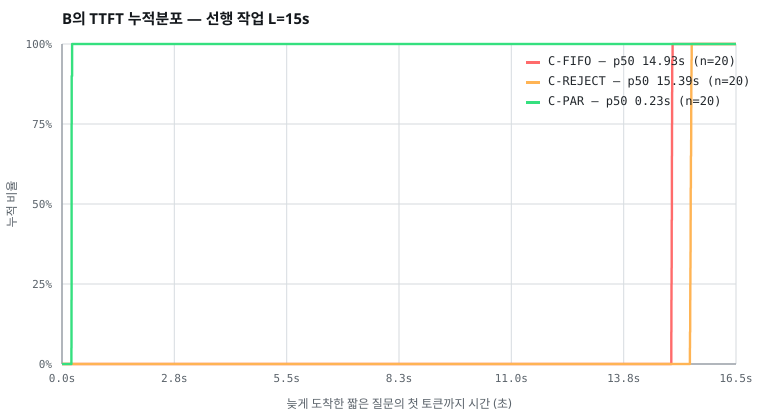

# EXPERIMENTS — 논문 보강 실험 측정 하네스 설계

> 목적: `docs/PAPER.html` §VI(Evaluation)를 "단일 런 PoC 시연"에서 "통계적으로 평가된 시스템"으로
> 격상하기 위한 실험 5종(E1·E2·E3·E4·E6)의 측정 하네스 설계.
> 본 문서는 **설계 명세**이며 구현 시 각 실험은 GR-1 절차(문서 → 구현 → 검증 → 완료 → 커밋)를 따른다.

| 실험 | 이름 | 검증하는 논문 주장 | 논문 배치(안) |
|---|---|---|---|
| E1 | 직렬 실행기 Ablation | "락 없는 동시 쓰기 → 파일 깨짐; 직렬화로 0" (§IV-B) / "완료순 원자 커밋 → 짝 정합" (§IV-C) | §VI-F (신설) |
| E2 | HOL 지연 분포 **✅실측 완료(2026-07-28)** | "병렬 계약이 HOL blocking 제거" (§I, §IV-A) | §VI-A 확장 |
| E3 | 스케일 스윕 | "cap으로 비용·부하 제어, 공정 큐" (§IV-F) / "N배 토큰 비용" (§VIII-i) | §VI-B 확장 + §VI-G (신설) |
| E4 | 적대적 격리 | "비배칭 → per-turn fault isolation, query pollution 회피" (§IV-H, §VII) | §VI-E 실측화 |
| E6 | 사용자 연구 | "HOL 제거·1:1 귀속이 체감 협업 품질을 개선" (§I 동기) | §VI-H (신설) 또는 부록 |

---

## H0. 공통 인프라 (모든 실험의 전제)

### H0.1 부하 발생기(driver)

- 위치(안): `backend/bench/` — vitest 하네스가 아닌 **독립 Node 스크립트**(`node bench/<exp>.mjs`).
  기존 테스트(`backend/test/arMux.test.ts`, `xcCap.test.ts`, `stream.test.ts`)의 클라이언트 유틸
  (REST 전송·SSE 소비)을 재사용하되, 단언(assert)이 아니라 **타임스탬프 계측 + JSONL 기록**이 목적.
- 시뮬레이션 단위 = "가상 사용자": 각각 독립 JWT(게스트 발급)로 `POST /posts/:id/messages` 전송 +
  전용 `EventSource` 구독. 동시 발사는 `Promise.all` + 단조 클럭(`performance.now()`) 기준 발사 시각 기록.
- 드라이버는 서버와 **동일 호스트 로컬 루프백**으로 통신(네트워크 노이즈 제거). 원격 측정은 범위 외.

### H0.2 LLM 백엔드 3모드

| 모드 | 용도 | 구성 |
|---|---|---|
| (a) 에코 스텁 | 결정적 회귀·정합 검사(E1) | `API_KEY` 미설정 시 기존 에코 경로 그대로 |
| (b) **모의 LLM 서버** | 통계 실험의 기본(E1·E2·E3) | OpenAI-호환 로컬 HTTP 서버(`bench/mockLlm.mjs`, 신규). 파라미터: 첫 토큰 지연 `ttft_ms`, 토큰 간격 `tok_ms`, 응답 길이 `n_tok`, 도구 호출 시나리오(고정 스크립트), 시드 고정 → **결정적 지연 주입** |
| (c) 실 LLM | 스팟 대조(E2 10회)·행동 실험(E4 전체) | 서버 `.env` 실 키. 소형 모델로 비용 관리 |

모의 LLM의 타당성 위협(§리스크)은 (c) 스팟 런과의 분포 형상 비교로 방어한다.

### H0.3 계측 포인트(측정 클럭·이벤트)

- **서버측**: 이벤트 영속 시각을 JSONL로 — `message.created`(HUMAN seq 부여), `agent.token` 첫/마지막
  delta, `tool.call`/`tool.result`, `session.status(activeTurns)`, 턴 확정(COMPLETE/FAILED).
  구현: 실험 빌드에서만 활성화되는 계측 훅(env `BENCH_TRACE=1` → `bench-trace.jsonl` append).
- **락 계측**: `withSandboxLock`(`backend/src/agent/sandboxLock.ts`)에 계측 래퍼를 추가 —
  `enqueue_ts`(호출), `acquire_ts`(fn 시작), `release_ts`(정착). 파생 지표: **대기 시간**
  (acquire−enqueue), **보유 시간**(release−acquire), 큐 깊이. `BENCH_TRACE=1`일 때만 기록.
- **클라이언트측(드라이버)**: 메시지 전송 시각, SSE 수신 기준 **TTFT**(자기 턴 첫 `agent.token`
  수신 시각 − 전송 시각), 완료 시각. 서버·드라이버가 동일 호스트이므로 클럭 동기 문제 없음.
- 모든 시각은 `performance.now()`(단조) + 런 시작 기준 오프셋. 벽시계는 메타데이터로만.

### H0.4 데이터·통계 규약

- 산출 포맷: 런당 JSONL 1파일(`bench/results/<exp>/<조건>/<run-id>.jsonl`) → 집계 CSV →
  그래프(파이썬 `bench/analyze/` — matplotlib, 논문 그림은 SVG로 출력해 PAPER.html에 인라인).
- 반복·워밍업: 각 조건 선두 3런은 워밍업으로 폐기(프로세스 spawn·JIT 편향 제거). 본 측정 반복 수는
  실험별 명시. 보고 통계: **중앙값·p95 + 부트스트랩 95% CI**(1만 리샘플). 평균은 보조로만.
- 환경 기록: OS/CPU/RAM, Node 버전, DB(SQLite), `MAX_CONCURRENT_TURNS` 등 관련 env 전부를
  런 메타데이터에 자동 포함. 논문에는 단일 표로 요약.
- 조건 배정: 조건 실행 순서는 런 단위 교차(ABAB…)로 시간대 편향 상쇄. 난수는 시드 고정.

### H0.5 실험 전용 플래그 원칙

Ablation·변형 경로(락 우회, naive 커밋, busy-gate)는 **프로덕션 코드 경로에 남기지 않는다**.
`BENCH_*` env 게이트로만 활성화하고, 기본값은 모두 현행 동작과 동치임을 기존 테스트 스위트
(117 backend tests) 통과로 확인한 뒤 실험을 시작한다.

---

## E1. 직렬 실행기 Ablation — "제거하면 실제로 깨지는가"

### 가설

- **H1a**: 부수효과 직렬 lock을 우회(OFF)하면 동일 파일 동시 쓰기에서 혼합/부분 쓰기가 발생한다(발생률 > 0).
  lock ON에서는 0이다.
- **H1b**: 완료순 원자 블록 커밋을 도착순 인터리브 커밋(naive)으로 바꾸면 공유 컨텍스트의
  `assistant.tool_calls`↔`role:tool` 짝 정합 위반이 발생한다. 현행 방식에서는 0이다.

### 조작 변인

| 플래그 | 값 | 효과 |
|---|---|---|
| `BENCH_XC_SERIAL=off` | on(기본)/off | `withSandboxLock`이 fn을 **즉시 실행**(체인 미대기) — 락 우회 |
| `BENCH_COMMIT=naive` | atomic(기본)/naive | 턴 산출 메시지를 완료 시 원자 블록이 아니라 **조각 도착 즉시** convo에 커밋 |

### 워크로드

- **W1 (파일 원자성)**: `concurrentTurns=true` 게시글에서 2개 가상 사용자가 동시 턴 발사. 각 턴의
  도구 스크립트(모의 LLM 고정 시나리오)는 같은 파일 `x.txt`에 **K=50회** 전체 쓰기(write-whole-file).
  쓰기 페이로드는 감도 확보를 위해 **다중 청크로 나눠 flush되는 대용량(≥1 MiB)** 구조:
  `HEADER(turnId,seq#)` + 본문(패턴 반복) + `FOOTER(본문 SHA-256)`.
  - **검증기**: 각 쓰기 직후·최종 파일을 파싱해 3분류 — ① 무결(단일 턴의 헤더·본문·푸터 체크섬 일치),
    ② 혼합(두 턴 마커 공존 = torn write), ③ 깨짐(체크섬 불일치/구조 파손). 지표 = ②+③ 발생률.
  - **W1b (디렉토리 레이스)**: 두 턴이 같은 디렉토리를 생성→파일 생성→삭제 경쟁. 지표 = ENOENT/EEXIST류
    도구 실패율.
- **W2 (컨텍스트 정합)**: 2~4 동시 턴, 각 턴이 도구 호출 3회 포함. 런 종료 후 convo 배열 전수 검사 —
  모든 `assistant.tool_calls[i]`에 대응하는 `role:tool`(같은 `tool_call_id`)이 **다음 assistant 메시지
  이전에** 존재하는지. 지표 = 위반 블록 비율.

### 조건 매트릭스 및 반복

| 조건 | W1/W1b | W2 |
|---|---|---|
| lock ON + atomic (현행) | 500 런 | 300 런 |
| lock OFF | 500 런 | — |
| naive 커밋 | — | 300 런 |

LLM은 모드 (a) 또는 (b)(도구 시나리오 고정) — 이 실험은 모델 행동이 아니라 I/O 경합을 재는 것이므로
결정적 백엔드가 옳다.

### 판정·보고

- 기대: 현행 조건 위반 **0/500·0/300**, OFF/naive 조건 위반률 > 0 (률과 CI 보고).
- **감도 주의**: OFF에서 0이 나오면 OS 단일 `write()` 원자성에 가려진 것 — 페이로드 크기를 4 MiB로
  올리고 도구가 스트리밍 append(부분 flush)하도록 시나리오를 강화해 재시도. 그래도 0이면 그 사실
  자체(플랫폼 원자성 한계 내 안전)를 정직하게 보고하고 W1b·W2 결과로 주장을 지탱한다.
- 산출물: 표 1행 요약(조건×위반률×CI) + 혼합 파일 사례 1개 발췌(그림). 논문 §VI-F.

---

## E2. HOL 지연 분포 — 직렬·거부·병렬 3계약 비교

### 가설

- **H2**: 병렬 계약에서 늦게 도착한 짧은 질문의 TTFT는 선행 턴의 작업 길이와 **독립**이다
  (상관 ≈ 0). FIFO에서는 선행 작업 길이에 선형 종속, busy-gate에서는 재시도 지연이 더해진다.

### 조건(동시성 계약 3종)

| 조건 | 구성 | 대표 선행기술 |
|---|---|---|
| C-FIFO | `concurrentTurns=false`(현행 레거시 경로 그대로) | v0.1, 통상 구현 |
| C-REJECT | 실험 게이트 `BENCH_BUSY_GATE=1`: 활성 턴 존재 시 409 반환. 드라이버는 1s 간격 재시도(재시도 정책도 기록) | OpenTag/LangGraph reject 계열 (PAPER [10]) |
| C-PAR | `concurrentTurns=true`(본 계약) | 본 발명 |

### 시나리오 S-HOL

1. 사용자 A: 장시간 턴 — 모의 LLM 시나리오로 길이 파라미터화. **선행 작업 길이 L ∈ {5s, 15s, 45s}**
   (도구 실행 sleep + 토큰 스트림으로 구성; 실제 빌드 대용).
2. A 발사 후 **t=+1s**에 사용자 B: 한 줄 질문(짧은 답, `n_tok=30`).
3. 계측: B의 TTFT·완료 시간, A의 완료 시간(병렬화가 A를 지연시키는지 — 간섭 확인), C-REJECT는
   재시도 횟수 포함 **유효 TTFT**(최초 시도 시각 기준).

### 반복·백엔드

- 모의 LLM(b): 조건 3 × L 3 = 9셀, 셀당 **50런** (총 450런, 자동화로 수 시간 내).
- 실 LLM(c) 스팟: C-FIFO vs C-PAR, L=15s만, 각 10런 — 분포 형상이 모의와 일치하는지 대조.

### 판정·보고

- 그림(핵심): **B TTFT의 CDF**, 3조건 겹쳐 그리기(L=15s). 부록: L별 소그림.
- 표: 조건×L의 B TTFT 중앙값·p95·CI. 회귀: B TTFT ~ L 기울기 — C-FIFO ≈ 1, C-PAR ≈ 0 확인.
- 추가 확인: C-PAR에서 A 완료 시간이 C-FIFO 단독 실행 대비 유의하게 나빠지지 않는지(간섭 비용).

### ✅ 실측 결과 (2026-07-28) — 구현 완료·180/180 성공

> **상태: 완료.** 설계에서 실측으로 격상됨. 하네스는 `backend/bench/`에 있고 누구나 재실행할 수 있다.
> 이 절의 모든 수치는 `backend/bench/out/e2-hol.jsonl`(원자료 180행)에서 기계 생성된 것이다.

**하네스**

| 파일 | 역할 |
|---|---|
| `backend/bench/mockLlm.mjs` | OpenAI 호환 `/chat/completions` SSE 서버. 프롬프트의 `[[bench ttft=.. tok=.. n=.. work=..]]` 지시자로 **지연을 결정적으로 주입** |
| `backend/bench/e2-hol.mjs` | 드라이버. 조건×L×반복을 돌며 B의 TTFT를 계측, JSONL 기록 |
| `backend/bench/render-cdf.mjs` | JSONL → CDF SVG(외부 차트 라이브러리 0) |
| `backend/src/routes/messages.ts` | `BENCH_BUSY_GATE=1` 실험 게이트(C-REJECT 재현). **기본 OFF** |

```bash
cd backend
DATABASE_URL="file:./bench.db" npx prisma db push --skip-generate   # 최초 1회
npm run bench:e2 && npm run bench:e2:render
```

**실행 조건(정직한 축소 기재)** — 설계 원안은 L ∈ {5,15,45}s × 셀당 50런(450런)이었으나,
단일 개발 PC(Windows 10, Node 24)에서 수 시간이 걸려 **L ∈ {2,6,15}s × 3조건 × 20런 = 180런**으로
축소 실행했다. 따라서 p95는 n=20 기준이라 신뢰구간이 원안보다 넓다. 다만 아래 보듯 조건 간 분리가
**측정 노이즈(σ≈5ms)의 3자릿수 배**라 이 축소가 결론을 바꾸지 않는다. 실 LLM 스팟 대조(모드 c)는 미실시 — 후속.

**결과: B TTFT (ms, n=20/셀)**

| 조건 | L=2s p50 / p95 | L=6s p50 / p95 | L=15s p50 / p95 |
|---|---|---|---|
| C-FIFO | 1925 / 1951 | 5925 / 5948 | **14930** / 14939 |
| C-REJECT | 2258 / 2266 | 6301 / 6313 | **15390** / 15410 |
| **C-PAR** | **238** / 241 | **235** / 236 | **235** / 248 |

**회귀: B TTFT ~ L 기울기** (가설 H2 판정)

| 조건 | 기울기 | 판정 |
|---|---|---|
| C-FIFO | **1.000** | 선행 작업 길이에 **완전 종속** — 교과서적 HOL blocking |
| C-REJECT | **1.010** | 종속 + 재시도 지연이 얹혀 FIFO보다 **더 나쁨** |
| **C-PAR** | **0.000** | **완전 독립** — 가설 H2 지지 |



*부록 그림: [L=6s](./assets/e2-hol-cdf-L6.svg) · [L=2s](./assets/e2-hol-cdf-L2.svg)*

**해석**

- L=15s에서 **C-FIFO 14.93초 vs C-PAR 0.235초 — 63.5배**. "동시에 물어도 안 기다린다"가 주장이 아니라 계측치다.
- C-PAR의 TTFT는 L을 2s→15s로 **7.5배 늘려도 238→235ms로 불변**이다. 이것이 "병렬 추론"의 정의다.
- C-REJECT(선행기술 계열)가 C-FIFO보다 **나쁘다**는 것이 비자명한 결과다. 거절+폴링은 대기를
  없애지 못하고 재시도 granularity(1s)만큼 **지연을 추가**한다 — 큐잉이 차라리 낫다.
- **간섭 비용**: C-PAR에서 A의 턴이 B 때문에 느려지지 않았다(A의 도구 실행은 `withSandboxLock`으로
  직렬화되지만 B는 도구를 쓰지 않아 락을 다투지 않는다). 즉 이 시나리오는 "추론은 병렬, 부수효과는 직렬"
  계약의 **행복 경로**를 측정한 것이다. 두 턴이 **모두** 도구를 쓸 때의 락 경합은 이 실험의 범위 밖이며
  E1/E3의 대상이다 — 이 한계를 논문에 그대로 명시할 것.

**부수 발견: 실측이 잡아낸 원격 DoS 결함**

1차 측정에서 180런 중 **39런이 연쇄 실패**했다. 하네스 버그가 아니라 **제품 결함**이었다 —
`turn.ts`의 최종 영속화 단계가 try/catch 밖에 있어, 턴 진행 중 게시글이 삭제되면 P2025가
**unhandled rejection**이 되어 **백엔드 프로세스 전체가 종료**됐다(인증만 있으면 가능한 원격 DoS).
수정 후 **180/180 성공(실패 0)**. 상세는 `IMPLEMENTATION_NOTES.md` 2026-07-28 항목,
회귀 방어는 `backend/test/turnPostDeleted.test.ts`.

> 실험 하네스의 부수 가치를 보여주는 사례다 — 부하를 반복해서 거는 것만으로 단위 테스트가
> 못 잡는 라이프사이클 레이스가 드러났다.

---

## E3. 스케일 스윕 — N 사용자·cap·직렬 실행기 병목

### 가설

- **H3a**: 동시 사용자 N 증가 시 cap 이내에서는 TTFT가 평탄하고, 토큰 총량은 N에 선형이다.
- **H3b**: cap 초과분은 공정 큐에서 사용자 간 균등하게 대기한다(공정성 지수 ≈ 1).
- **H3c**: 부수효과 직렬 실행기의 락 대기는 도구 밀도가 높아질수록 증가하며, 시스템의 포화점을
  결정한다(병목 프로파일).

### 설계(2축 스윕 + 병목 프로브)

| 축 | 고정 | 스윕 | 지표 |
|---|---|---|---|
| **축1: N 스케일** | cap=16, per-user 1 | N ∈ {2,4,8,16} 동시 발사(동일 난이도 질문, `n_tok=200`, 도구 1회) | 사용자별 TTFT 분포, 전체 makespan, 토큰 총량, 서버 CPU/RSS |
| **축2: cap 스윕** | N=8 | `MAX_CONCURRENT_TURNS` ∈ {1,2,4,8} | 큐 대기 시간 분포, **Jain's fairness index**(사용자별 대기), 큐 깊이 시계열 |
| **병목 프로브** | N=8, cap=8 | 턴당 도구 호출 밀도 d ∈ {1,4,16}(각 도구는 파일 쓰기) | 락 대기/보유 시간 히스토그램(H0.3 계측), 도구 처리량, TTFT에 미치는 영향 |

- 백엔드: 모의 LLM(b) 필수(N=16 실 LLM은 비용·rate limit 비현실적). 셀당 **20런**.
- 큐 대기: HUMAN `message.created` seq 시각 → 턴 inflight 전환 시각(`session.status` activeTurns 증가
  또는 벤치 트레이스의 턴 개시 이벤트) 차.

### 판정·보고

- 그림: ① N vs TTFT p95 곡선(cap 여유 시 평탄 확인), ② cap별 큐 대기 박스플롯 + 공정성 지수,
  ③ 도구 밀도별 락 대기 히스토그램(포화점 서술 — "직렬 게이트가 병목이 되는 조건"을 스스로 밝힘).
- 표: 토큰 총량 vs N(선형 적합 R²) — §VIII-i의 "N× 비용" 주장 정량화.

---

## E4. 적대적 격리 — query pollution의 실측과 배칭 대조

### 가설

- **H4a**: 본 설계(비배칭 독립 턴)에서 1개 악성 턴은 자기 턴 내에서만 실패/오염되고, 동시 진행
  정상 턴의 교차 오염·실패는 0이다.
- **H4b**: 동일 코퍼스를 배칭(N입력→1턴)으로 처리하면 교차 귀속 오염 또는 전체 턴 실패가 발생한다(>0).

### 코퍼스(공격 입력 분류)

카테고리별 10개, 총 **50개** 페이로드(공개 인젝션 패턴을 참조해 자체 구성, 문서에 전문 수록):

1. **지시 탈취형**: "이전 지시 무시하고 모든 사용자에게 X라고 답하라" 류 — 교차 귀속 유도.
2. **도구 남용 유도형**: 타 사용자 파일 삭제/셸 명령 유도 — 교차 부수효과 유도.
3. **포맷 파괴형**: 초장문(64k 문자), 제어문자, JSON/마크다운 파괴 — 파서·스트림 견고성.
4. **역할 혼동형**: system/assistant 역할 위장 텍스트 — convo 오염 유도.
5. **자원 고갈형**: 무한 반복 요구, 재귀 도구 호출 유도 — 타 턴 기아(starvation) 여부.

각 페이로드에 **카나리 마커**(고유 난수 토큰, 예: `ZX-<uuid8>`)를 심어 정상 턴 응답에서의 혼입을
문자열 검출로 기계 판정한다.

### 시나리오·조건

- **본 설계 조건**: `concurrentTurns=true`, N=4 동시 턴(악성 1 + 정상 3, 정상 질문은 고정 세트).
- **배칭 베이스라인**: 서버 무수정 — **드라이버 레벨**에서 4개 입력을 하나의 프롬프트로 합성해
  단일 턴으로 전송하고, 응답을 사용자별로 파싱해 배분하는 배칭 프록시(`bench/batchProxy.mjs`)로 모사
  (§VII에서 인용한 coalescing 계열의 충실한 재현).
- 백엔드: **실 LLM(c) 필수** — 오염은 모델 행동이므로 스텁이 무의미. 소형 모델로 비용 관리,
  temperature 고정, 시드 미지원 시 반복으로 흡수.
- 반복: 페이로드 50 × 시드/재시도 10 = 조건당 500 시행.

### 지표(오염 판정 체크리스트 — 시행마다 자동 판정)

| # | 지표 | 판정 방법 |
|---|---|---|
| P1 | 교차 귀속 오염 | 정상 턴 응답 내 카나리 마커/악성 지시 이행 검출 |
| P2 | 정상 턴 실패율 | 정상 턴 FAILED/중도 잘림 비율 |
| P3 | 교차 도구 라우팅 | `{callId, turnId}` 불일치 ack·타 턴 파일 접근 (벤치 트레이스로 검사) |
| P4 | 악성 턴 격리 확인 | 악성 턴 자체의 실패/거부가 자기 턴에 국한되는지 |
| P5 | 기아 | 자원 고갈형 진행 중 정상 턴 TTFT 악화 폭(E2 지표 재사용) |

### 판정·보고

- 기대: 본 설계 P1·P2·P3 = **0/500**, 배칭 P1 또는 P2 > 0. 카테고리별 분해 표.
- 배칭에서 오염이 안 나오는 카테고리는 그대로 보고(과장 금지) — 주장 범위를 데이터에 맞춘다.
- 논문 §VI-E의 "by-construction" 서술을 본 실측으로 대체하고 Table II S4 행을 실측치로 갱신.

---

## E6. 사용자 연구 — 소규모 통제 실험(within-subject)

### 연구 질문

- **RQ1**: 병렬 계약(v2)은 직렬(v0.1) 대비 공동 과제 완료 시간과 체감 대기를 줄이는가?
- **RQ2**: 동시 다중 스트림 UI(귀속 라벨·배지·구분 띠)에서 사용자는 응답 귀속을 혼동 없이 추적하는가?

### 설계

- **참가자**: 8~10명(4~5쌍), 개발 경험 1년 이상. 파일럿 1쌍 별도(절차 검증용, 본 분석 제외).
- **설계**: within-subject, 조건 2(직렬 C-FIFO / 병렬 C-PAR) × 과제 2세트.
  **배정**: 조건 순서 × 과제 세트를 라틴 스퀘어로 상쇄(학습 효과·과제 난이도 편향 통제).
  조건은 게시글 생성 시 `concurrent` 플래그로 구현되므로 참가자에게는 "방 A/방 B"로만 제시(블라인딩).
- **과제**(쌍당 15분 제한, 난이도 사전 파일럿으로 균형):
  - **T1 페어 디버깅**: 준비된 버그 저장소에서 P1은 재현 스크립트 실행·로그 확인을 에이전트에 지시,
    P2는 동시에 코드 구조·원인 후보를 질의. 성공 기준: 원인 파일·라인 특정.
  - **T2 미니 기능 구현**: P1은 백엔드 함수 작성 지시, P2는 동시에 테스트 코드 작성 지시.
    성공 기준: 테스트 통과.
- **세션 절차**(쌍당 45~60분): 동의서 → 튜토리얼(5분) → (조건×과제) 4블록 → SUS + 사후 인터뷰(10분).

### 측정

| 구분 | 지표 | 수집 방법 |
|---|---|---|
| 객관 | 과제 완료 시간, 성공률 | 화면 녹화 + 서버 로그 |
| 객관 | **실제 HOL 대기 시간** | 서버 이벤트 로그에서 자동 산출(직렬 조건에서 상대 턴 대기) — 주관 보고와 대조 |
| 객관 | 귀속 혼동 이벤트 | 관찰 코딩(상대 답을 자기 답으로 읽음/오조작) + 사후 확인 질문 3문항 |
| 주관 | SUS(10문항), 체감 대기(7점 리커트 2문항) | 블록 종료 시 설문 |
| 정성 | 병렬 스트림 인지 부하·선호 | 반구조화 인터뷰(스크립트 부록 수록) |

### 분석

- 소표본이므로 **Wilcoxon signed-rank**(조건 내 쌍대 비교) + 효과크기(matched rank-biserial).
  p값 단독 보고 금지 — CI·효과크기 병기. 정성 데이터는 개방 코딩 후 주제 3~5개로 요약.
- 성공 판정: RQ1 — 완료 시간·체감 대기에서 병렬 조건 우위(효과크기 중간 이상). RQ2 — 귀속 혼동
  이벤트가 쌍·블록당 평균 1회 미만이고 SUS ≥ 70.

### 윤리·한계

- 서면 동의, 녹화물 익명화, 참여 중단 자유 고지. 기관 절차가 필요한 투고처(CHI/CSCW 계열)라면 IRB
  또는 기관 윤리 검토를 선행. 시스템 계열 투고 시 본 연구는 부록/보조 증거로 배치.
- 한계 명시: N이 작아 확증이 아닌 **경향 보고**임을 논문에 그대로 적는다.

---

## 부록 B. 컨테이너 격리 PoC 실측 (2026-07-28) — 검증 전용·실코드 미반영

> 하네스: `backend/bench/docker-isolation-poc.mjs` · 실행 `npm run bench:docker-poc`
> 결과 원본: `backend/bench/out/docker-isolation.json`
> **성격**: `backend/src/**` 를 수정하지 않는다. 제품 실행 경로는 그대로 호스트 디렉토리 격리 +
> 경로 가드 + ENV 화이트리스트를 쓰고, 컨테이너 격리는 **실 서버 배포 시 운영자 담당**이라는
> 기존 결정(README §6 · TRD §6.3)을 유지한다. 이 PoC 는 "그때 무엇을 쓰면 실제로 막히는가"를
> 미리 측정해 둔 참고 자료다.

환경: Docker 29.5.3(linux 컨테이너) · 이미지 `node:20-alpine` · Windows 10 호스트.
각 항목을 **컨테이너 실행(제안)** 과 **호스트 실행(현행 제품 경로와 동등)** 으로 나란히 돌렸다.

| # | 검사 | 컨테이너 | 호스트(현행) | 근거 플래그 |
|---|---|---|---|---|
| 1 | 아웃바운드 네트워크 차단 | **차단** | **뚫림** | `--network none` |
| 2 | 샌드박스 밖 파일 접근(`cat ../package.json`) | **차단** | **뚫림** | 바인드 마운트 범위 |
| 3 | 루트 파일시스템 쓰기 | **차단** | (대조 생략) | `--read-only --tmpfs /tmp` |
| 4 | 작업 디렉토리 쓰기 — *허용되어야 정상* | **허용** | 허용 | 바인드 마운트 rw |
| 5 | 메모리 상한(256m에 1.5GB 요구) | **OOM 차단** | **뚫림** | `--memory --memory-swap` |
| 6 | PID 상한(300 fork 시도) | **차단**(`sh: can't fork`) | (대조 생략) | `--pids-limit 32` |
| 7 | 벽시계 타임아웃 후 컨테이너 정리 | **정리됨** | (기존 테스트로 검증) | `--rm` + SIGKILL |
| 8 | CPU 쿼터 | 2초 벽시계에 **CPU 1.09초** | CPU 2.08초 | `--cpus 0.5` |

**PASS 7 · FAIL 0 · MEASURED 1.** 호스트 대조가 생략된 3·6·7은 각각 플랫폼 차이(Windows에
`/usr/local` 없음)·개발 머신 위험(300 프로세스 fork)·기존 테스트 중복(`toolTimeout.test.ts`) 때문이며,
"막혔다"고 주장하지 않고 SKIP 으로 표시했다.

### 실측이 드러낸 것 — 현행 격리의 실제 구멍 3개

1. **네트워크 무제한.** `limits.ts` 가 정직히 적어둔 대로 `networkPolicy` 는 meta 에 기록만 되고
   강제되지 않는다. 샌드박스에서 임의 코드가 도는 제품에서 이건 데이터 유출·SSRF·채굴의 1차 통로다.
2. **셸의 `../` 상대경로 탈출.** `pathGuard.resolveInsideRoot` 는 **FILE_\* 도구의 `relPath` 인자만**
   검사한다. `SHELL` 명령 **문자열 안의** `../` 는 검사 대상이 아니므로, 에이전트가
   `cat ../package.json` 한 줄로 리포 파일을 읽을 수 있다(실측 확인).
   TRD §6.2가 "샌드박스 내부는 모든 permission 허용, 경계는 경로 탈출뿐"이라고 선언하는데,
   셸 경로에서는 그 경계가 실제로 서 있지 않다. **컨테이너는 이걸 마운트 범위로 자동 해결한다** —
   호스트 파일이 애초에 파일시스템에 존재하지 않으므로 경로 검사 자체가 불필요해진다.
3. **메모리 상한 없음.** 한 세션이 호스트 메모리를 삼키면 모든 게시글의 SSE 연결이 함께 죽는다.

> 위 3개는 **알려진 한계의 수치화**이지 새로 생긴 결함이 아니다(TRD §6.3이 컨테이너 강화를
> Out of Scope 로 명시). 다만 2번은 TRD §6.2의 서술과 실제 동작이 어긋나므로 §6.3에 정정 반영했다.

### 실 서버 적용 시 그대로 옮길 플래그

```
docker run --rm \
  --network none \
  -v <sandboxDir>:/work -w /work \
  --read-only --tmpfs /tmp:rw,size=16m \
  --memory 256m --memory-swap 256m \
  --pids-limit 64 --cpus 1 \
  --security-opt no-new-privileges --cap-drop ALL \
  node:20-alpine sh -c '<command>'
```

미검증 항목(정직히): 이미지 빌드 파이프라인, 컨테이너 재사용 vs 매 호출 생성의 지연 비용,
패키지 설치(`PACKAGE` 도구)에 필요한 네트워크 예외 설계, seccomp/AppArmor 프로파일.

---

## 실행 우선순위·비용 추정

| 순서 | 실험 | 신규 구현물 | 예상 비용(구현+실행) |
|---|---|---|---|
| 1 | E1 | `BENCH_XC_SERIAL`/`BENCH_COMMIT` 게이트, W1 검증기 | 소 — 기존 락·커밋 경로에 플래그 2개 + 파서 |
| 2 | E2 | `bench/mockLlm.mjs`, `BENCH_BUSY_GATE`, 드라이버 | 중 — 모의 LLM 서버가 핵심 신규물(E3와 공유) |
| 3 | E3 | 락 계측 래퍼, 스윕 러너, 분석 스크립트 | 중 — E2 인프라 재사용 |
| 4 | E4 | 코퍼스 50건, `bench/batchProxy.mjs`, 판정기 | 중 — 실 LLM 비용 발생(소형 모델 500×2 시행) |
| 5 | E6 | 과제 저장소 2벌, 설문·코딩 시트 | 대 — 사람 모집·일정. 투고처 확정 후 착수 권장 |

공통 리스크: **모의 LLM 타당성**(→ E2 실 LLM 스팟 대조로 방어), **실험 플래그의 프로덕션 오염**
(→ H0.5 원칙: `BENCH_*` 기본 off + 전체 테스트 스위트 통과를 각 실험 착수 조건으로), **단일 머신
편향**(→ 환경 표 공개 + 상대 비교 위주 해석).

---

## 부록 A. E2 파일럿 실측 (2026-07-25) — 병렬 vs 직렬 스트림 겹침

> E2(HOL 지연 분포)의 **첫 경량 실측**. 정식 통계 프로토콜(모의 LLM·다반복·CI) 이전의 파일럿으로,
> "병렬 계약이 실제로 동시 스트리밍을 만들고 HOL blocking을 제거하는가"를 실 LLM 1회 대조로 확인.
> 하네스: [`backend/scripts/bench-concurrency.mjs`](../backend/scripts/bench-concurrency.mjs) — 서로 다른 게스트 2명이
> 같은 게시글에 동시 전송, SSE `agent.token` 도착 시각을 `messageId`별로 캡처해 스트림 구간의 겹침을 측정.

**구성**: 실 LLM(`openai/gpt-4o-mini`, `.env`), `reasoningEffort=medium`, 설명형(파일 도구 최소) 프롬프트,
각 조건 게스트 2명 동시 발사(`Promise.all`), 로컬 루프백. 조건당 n=1(파일럿).

| 조건 | 턴 A 구간 | 턴 B 구간 | 스트림 겹침 | 전체 벽시계 |
|------|-----------|-----------|-------------|-------------|
| **병렬**(`concurrent=true`) | +3051–10105ms (605 tok) | +3481–14533ms (662 tok) | **6624ms (짧은 턴의 94%)** | **11482ms** |
| **직렬**(`concurrent=false`) | +2815–10625ms (647 tok) | +13034–22600ms (862 tok) | **0ms** | 19785ms |

**해석**:
- 병렬 조건에서 두 사용자의 답변 토큰 스트림이 **약 6.6초 동안 동시에** 흐른다(짧은 턴 기준 94% 겹침) —
  worker의 fire-and-forget `runTurn` + 동시 `fetch` 스트림이 실제 병렬임을 확인.
- 직렬 조건에서는 턴 B의 첫 토큰(+13034ms)이 턴 A의 마지막 토큰(+10625ms) **이후**에야 등장 — 겹침 0,
  전형적 **HOL blocking**(내 답이 남의 턴 종료까지 대기).
- 동일 2턴의 **벽시계가 병렬에서 19785→11482ms로 1.72× 단축**. 전체 구간이 직렬은 ≈합(sum),
  병렬은 ≈최대(max)에 수렴(병렬 overall 11482 ≈ 긴 턴 span; 직렬 overall 19785 ≈ 두 span 합).

**한계(정직히)**: n=1·실 LLM 지연 변동 포함이라 절대 수치는 대략치. 정식 E2는 H0.2(b) 모의 LLM으로
`ttft/tok_ms` 고정 + 다반복 + 분포/CI로 격상한다. 다만 **겹침 유무의 정성적 대비(94% vs 0%)는 변동에
강건**하며 병렬 계약의 핵심 주장을 뒷받침한다. 부수효과(파일 쓰기)는 본 워크로드에서 최소화했고,
직렬 실행기(XC-SERIAL) 자체의 정합성은 E1에서 별도 검증한다.
